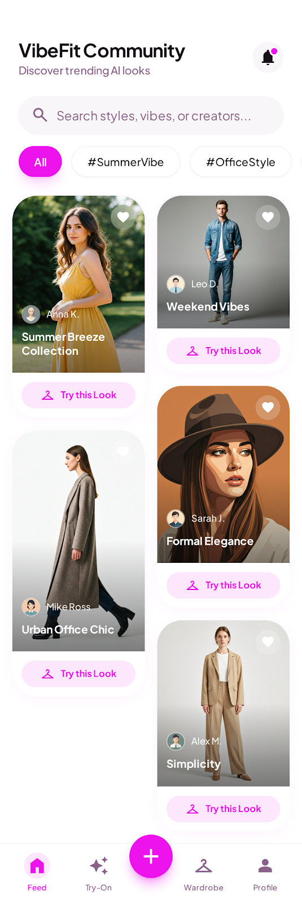
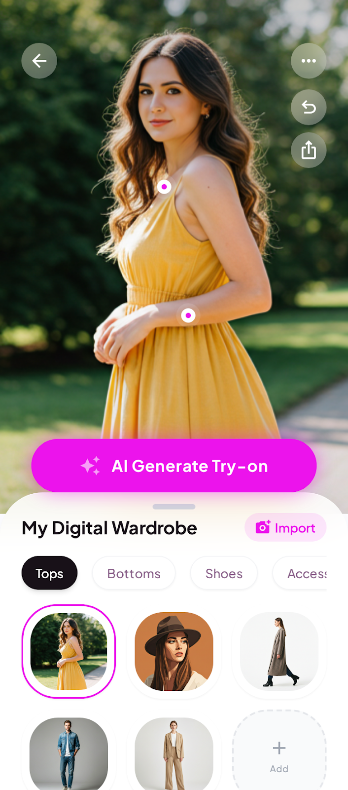
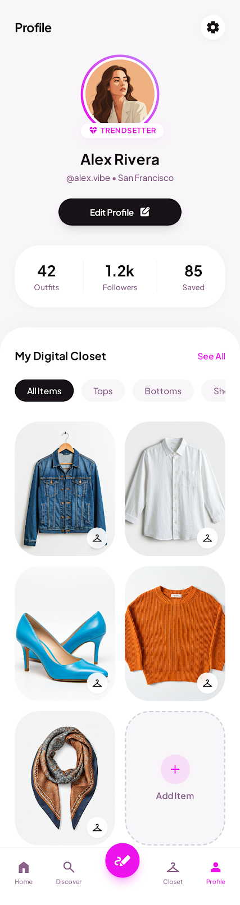

# VibeFit

VibeFit 是面向新一代用户的 AI 穿搭平台，围绕“发现灵感、即时试穿、沉淀风格”三大体验，打造从内容到决策的一站式时尚闭环。用户可以在社区中快速获取热门穿搭灵感，在试衣场景中完成 AI 生成预览，并将高价值单品沉淀到个人数字衣橱，持续形成可复用的个人风格资产。

## 产品亮点

- 内容驱动：通过社区内容流持续提供高质量穿搭灵感，降低搭配决策成本。
- AI 试穿：基于单品选择与场景组合，快速生成可视化试穿结果，提升转化效率。
- 数字衣橱：支持分类管理个人单品，沉淀长期可运营的穿搭数据。

## 适用场景

- 日常出行、通勤、约会等多场景穿搭决策
- 社区种草后的快速试穿与风格确认
- 个人穿搭资料的长期管理与复用

## 界面展示

### 社区内容流

### AI 试衣间

### 个人主页与数字衣橱

